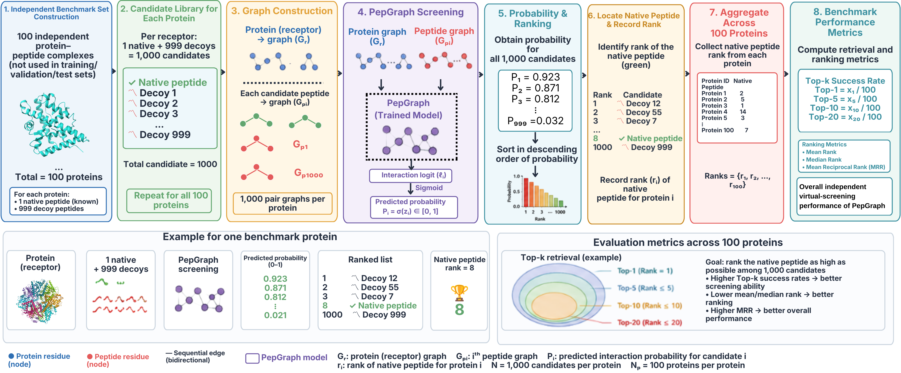

# PepGraph: Graph Neural Network Framework for Protein–Peptide Interaction Prediction

PepGraph is a graph neural network (GNN)-based framework for predicting protein–peptide interactions and ranking candidate peptides according to their predicted interaction probability.

The prediction pipeline accepts:

- one protein sequence in FASTA format
- one or more candidate peptide sequences in FASTA format

For each protein–peptide pair, PepGraph generates an interaction probability, classifies the pair as **Binding** or **Non-binding**, and ranks the candidate peptides according to their predicted probability.

---

## Prediction Workflow

The complete PepGraph prediction workflow is illustrated below, from independent benchmark/candidate-library construction through graph construction, model screening, peptide ranking, and evaluation.



**Figure:** Overview of the PepGraph independent virtual-screening and ranking workflow.

## Features

- Protein–peptide interaction prediction
- Graph-based representation of protein and peptide sequences
- GNN/GAT-based model architecture
- Sequence validation before prediction
- Batch evaluation of multiple candidate peptides
- Probability-based peptide ranking
- CSV output for downstream analysis
- CPU and CUDA-enabled execution when a compatible PyTorch installation is available

---

## Repository Structure

```text
PepGraph/
│
├── predict.py
├── best_model.pth
├── requirements.txt
├── README.md
├── LICENSE
│
├── models/
│   ├── gat_model.py
│   ├── gnn_encoder.py
│   └── pepgnn.py
│
├── prediction/
│   ├── fasta_reader.py
│   ├── validator.py
│   └── ranking.py
│
├── utils/
│   └── inference.py
│
├── features/
│   └── aaindex_normalized.csv
│
└── example/
    ├── protein.fasta
    └── peptides.fasta
```

`__pycache__` folders and Python bytecode files (`*.pyc`) are not required for the software release.

---

# Installation

## 1. Clone the repository

```bash
git clone <YOUR_GITHUB_REPOSITORY_URL>
cd PepGraph
```

Replace `<YOUR_GITHUB_REPOSITORY_URL>` with the URL of the final PepGraph GitHub repository.

## 2. Create a Python environment

### Windows

```bash
python -m venv venv
venv\Scripts\activate
```

### Linux/macOS

```bash
python -m venv venv
source venv/bin/activate
```

## 3. Install dependencies

```bash
pip install -r requirements.txt
```

For GPU execution, install a PyTorch build compatible with the CUDA version available on the system, if required.

---

# Quick Start

PepGraph requires two FASTA files:

1. a protein FASTA file
2. a peptide FASTA file containing one or more candidate peptides

Example:

```text
example/
├── protein.fasta
└── peptides.fasta
```

Run:

```bash
python predict.py --protein example/protein.fasta --peptides example/peptides.fasta --output predictions.csv
```

The predictions will be saved as:

```text
predictions.csv
```

---

# Input Format

## Protein FASTA

The protein file should contain a protein sequence in standard FASTA format.

Example:

```fasta
>Protein_Example
MKTIIALSYIFCLVFADYKDDDDK
```

## Peptide FASTA

The peptide file can contain multiple candidate peptides.

Example:

```fasta
>Peptide_001
GFLK
>Peptide_002
LLKLL
>Peptide_003
KWKLF
>Peptide_004
RLLRR
>Peptide_005
GLFDIIKKIAESF
```

Each peptide should have a unique FASTA identifier.

---

# Prediction Command

The general command is:

```bash
python predict.py --protein <protein.fasta> --peptides <peptides.fasta> --output <output.csv>
```

For example:

```bash
python predict.py \
    --protein protein.fasta \
    --peptides peptides.fasta \
    --output predictions.csv
```

On Windows Command Prompt, the same command can be written on one line:

```cmd
python predict.py --protein protein.fasta --peptides peptides.fasta --output predictions.csv
```

The `--output` argument is optional. If it is omitted, the default output filename is:

```text
predictions.csv
```

# Output Format

The prediction output is a CSV file containing:

| Column | Description |
|---|---|
| `Protein_ID` | Identifier of the input protein |
| `Peptide_ID` | Identifier of the candidate peptide |
| `Peptide_Sequence` | Candidate peptide sequence |
| `Probability` | Predicted protein–peptide interaction probability |
| `Prediction` | Predicted interaction class |

Example:

```text
Protein_ID,Peptide_ID,Peptide_Sequence,Probability,Prediction
Protein_Example,Peptide_001,GFLK,0.9437,Binding
Protein_Example,Peptide_002,LLKLL,0.8124,Binding
Protein_Example,Peptide_003,KWKLF,0.6215,Binding
Protein_Example,Peptide_004,RLLRR,0.3187,Non-binding
```

The numerical values above are illustrative only.

---

# Model

PepGraph uses a graph neural network framework to represent protein and peptide sequences as graphs and predict their interaction probability.

The model implementation is organized into:

```text
models/gat_model.py
models/gnn_encoder.py
models/pepgnn.py
```

The trained model parameters are provided in:

```text
best_model.pth
```

The prediction script loads these trained parameters automatically.

---

# Feature Representation

PepGraph uses amino-acid physicochemical representations derived from AAindex descriptors.

The feature information required by the prediction pipeline is provided with the software release where applicable.

The feature-processing and graph-construction implementation is contained in the corresponding project modules.

---

# Model Weights

The trained model checkpoint is:

```text
best_model.pth
```

The prediction script expects this file in the root directory of the repository.

Do not rename or move the checkpoint unless the corresponding path in `predict.py` is also updated.

---

# Hardware

PepGraph can run on:

- CPU
- CUDA-enabled GPU with a compatible PyTorch installation

The prediction script automatically selects CUDA when available and otherwise uses the CPU.

No separate command is required to select the device.

---

# Reproducibility

The repository is intended to provide the code and trained model required to reproduce PepGraph predictions.

The training/development datasets and large intermediate feature files are not required for routine prediction and are therefore not included in the minimal prediction release.

For details of dataset construction, feature selection, model training, benchmarking, and experimental evaluation, please refer to the associated publication and supplementary information.

---

# Example

After installation:

```bash
python predict.py \
    --protein example/protein.fasta \
    --peptides example/peptides.fasta \
    --output example_predictions.csv
```

The program will display the ranked predictions and save them to:

```text
example_predictions.csv
```

---

# Citation

If you use PepGraph in your research, please cite:

> **[Add the final PepGraph manuscript citation here after publication/submission.]**

---

# License

This project is released under the license specified in `LICENSE`.

---

# Contact

For questions, issues, or scientific collaboration, please use the GitHub repository issue tracker or contact the corresponding author listed in the associated publication.
